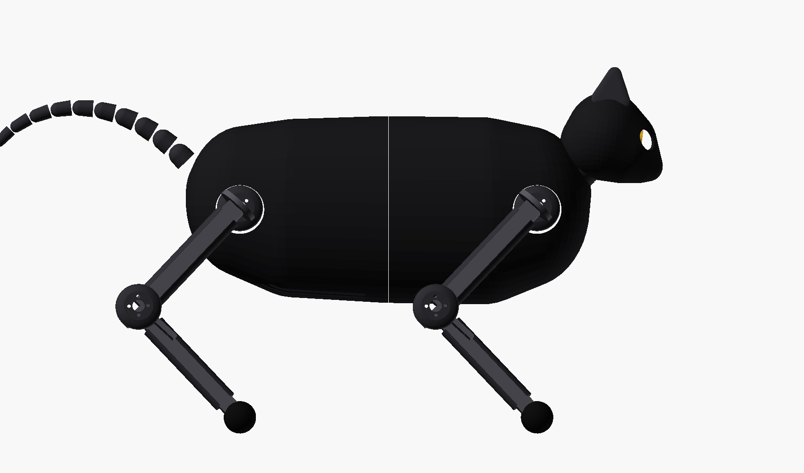
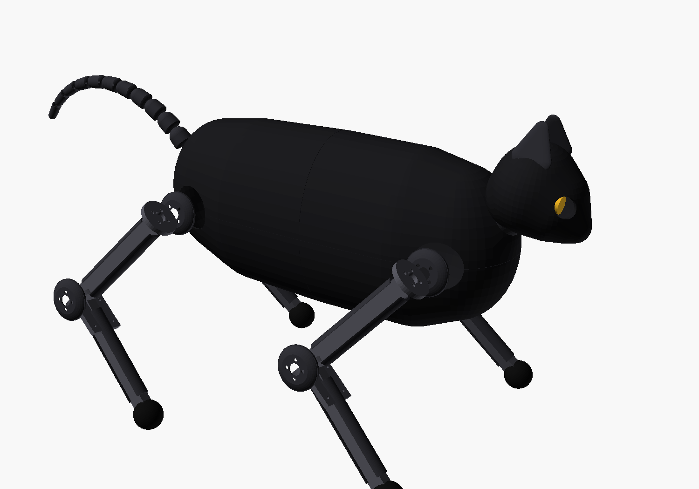

# CAD — rama i nogi, do druku

Sześć części, parametrycznie powiązanych z `cat.urdf.xacro` i `leg_ik.py`, żeby
nie mogły się z nimi rozjechać. OpenSCAD, bez zewnętrznych bibliotek.

Dwie warstwy, celowo rozdzielone. **Konstrukcja** trzyma kota do kupy i to
na niej liczono momenty. **Skorupa** decyduje tylko o tym, jak wygląda —
siedzi w osobnych plikach i osobnych zmiennych, żeby poprawianie urody nie
mogło po cichu zmienić niczego, od czego zależy chód.

### Konstrukcja

| plik | co to jest | ile drukować |
|---|---|---|
| `thigh_segment.scad` | segment uda | ×4 |
| `calf_segment.scad` | segment goleni | ×4 |
| `hip_link.scad` | łącznik biodro→udo (25 mm) | ×4 |
| `trunk_frame.scad` | rama tułowia — drabinka, nie skorupa | ×1 |
| `pi_shelf.scad` | półka pod Raspberry Pi 5 | ×1 |
| `paw_pad.scad` | nakładka łapy | ×4, materiał do wyboru |

### Skorupa

| plik | co to jest | ile drukować |
|---|---|---|
| `shell_back_front.scad` | grzbiet, przód — kłąb i nasada szyi | ×1 |
| `shell_back_rear.scad` | grzbiet, tył — zad i nasada ogona | ×1 |
| `shell_belly_front.scad` | brzuch, przód — klapa dostępowa | ×1 |
| `shell_belly_rear.scad` | brzuch, tył — z kratką głośnika | ×1 |
| `head_upper.scad` | czaszka: oczodoły, gniazda uszu, gródź kamery | ×1 |
| `head_lower.scad` | żuchwa i pysk | ×1 |
| `ear.scad` | ucho | ×2 |
| `neck_collar.scad` | kołnierz szyi, pierścienie | ×1 |
| `joint_cap.scad` | krążek na staw — biodra i kolana | ×8 |
| `thigh_fairing.scad` | osłona uda, zatrzaskowa | ×4 |
| `calf_fairing.scad` | osłona goleni | ×4 |
| `tail_segment.scad` | segment ogona (`-D seg=N`, N=0..10) | ×11 |
| `tail_plate.scad` | wszystkie 11 segmentów na jednej płycie | podgląd |
| `cat_assembly.scad` | cały kot w skorupie | podgląd |

## Wymiary serwa są zmierzone, nie zgadnięte

Wcześniejsza wersja tego pliku kazała wydrukować jedną sztukę `hip_link`,
przyłożyć do fizycznego serwa i poprawić cztery liczby, bo rozstawu śrub nie
dało się skądkolwiek pobrać. **To już nieaktualne.** Rozstawy zostały
zmierzone z oficjalnego modelu CAD serwa i potwierdzone drugim źródłem —
metoda, źródła i surowe liczby są w [measure/README.md](measure/README.md).

Najkrócej:

- **orczyk: 4 × Ø2,5 na okręgu Ø14,00**, co 90°, ustawione pod 45°. Ten sam
  wzór jest po obu stronach, bo serwo jest dwuosiowe.
- **śruby obudowy: y = ±10,25, x = +4,2 / −16,5 / −20,3** względem środka
  serwa. Tak mocuje się korpus serwa do ramy — bez żadnego pobieranego
  uchwytu.
- **oś wyjściowa leży 10,2 mm od bliższego czoła**, nie w środku. Dlatego
  płytka mocująca jest chorągiewką w jedną stronę, a nie symetryczną płytą.
- **obudowa ma 35,4 mm, nie 35,0**, a z czopami całość ma 39,6 mm. Sklepowe
  „45,2 × 24,7 × 35" opisuje samą obudowę.

Uchwytu z Printables 653674 **nie trzeba już pobierać** — cała niepewność
wisiała właśnie na nim.

## Co jest zweryfikowane, a co nie

| wartość | źródło | pewność |
|---|---|---|
| długości segmentów (110/110/25 mm) | `leg_ik.py` / `cat.urdf.xacro` | **pewne** — to własny, testowany model |
| rozstaw bioder (220×110 mm) | ten sam model | **pewne** |
| gabaryt i rozstawy ST3215 | oficjalny CAD, patrz `measure/` | **pewne** — dopasowanie okręgu z błędem 0,000 mm |
| wzór montażowy Pi 5 (58×49 mm, Ø2,7) | oficjalny rysunek mechaniczny Raspberry Pi Ltd (RP-008347-DS-1) | **pewne** |
| orientacja serwa ID1 w narożniku | — | **do sprawdzenia na fizycznej części** — rama zakłada, że wszystkie cztery serwa stoją tak samo, zgodnie z regułą „cztery identyczne nogi" |

## Skorupa — czego dotyka, a czego nie

Skorupa jest **wyłącznie kosmetyczna**. Nie przenosi obciążeń; nosi je
drabinka `trunk_frame`. Dlatego ma ścianę 1,8 mm (trzy ścieżki po 0,6),
a nie konstrukcyjne 4 mm.

Cała organika to **otoczka wypukła kul**, i to nie z lenistwa: wewnętrzny
odsunięty kształt otoczki kul to dokładnie otoczka tych samych kul o
promieniach mniejszych o grubość ścianki. Skorupa o stałej grubości to więc
dwie otoczki odjęte od siebie — bez `offset()`, bez `minkowski()`, bez
ryzyka niedomkniętej siatki.

**Pułapka, na którą już raz wpadłem:** stacje w `body_stations` to **środki
kul**, nie punkty powierzchni. Stacja o promieniu *r* w *x* wystawia skorupę
do *x ± r*. Rozstawienie ich tak, jakby były punktami obrysu, daje korpus
356 mm zamiast 300. Po każdej zmianie tej listy uruchom:

```bash
python3 measure/fit_check.py
```

### Dlaczego skorupa nie przeszkadza nogom

Bo to sprawdzone, nie założone. `measure/envelope.py` przepuszcza przez
prawdziwy kod chodu każdą pozę, jaką robot potrafi zakomendować — marsz
0,10 m/s, pełny skręt, stanie, przeciąganie, leżenie — i liczy, gdzie
zajdzie kolano i łapa:

| | |
|---|---|
| najbliżej osi symetrii | \|y\| = 84,6 mm |
| połowa szerokości korpusu | 55,5 mm |
| **zapas** | **29,1 mm** |

Noga nigdy nie wchodzi pod korpus, więc skorupa może być pełnym, gładkim
kształtem. Przebijają ją tylko cztery biodra. Po zmianie parametrów chodu
uruchom ten skrypt ponownie.

### Ile ta skorupa kosztuje — i to nie w złotówkach

**401 g PETG.** To 20% masy całego robota i najważniejsza liczba w tym
katalogu, bo momenty na serwach rosną z masą praktycznie liniowo — przy
0,10 m/s obciążenie jest zdominowane przez grawitację, nie przez
bezwładność.

| | bez skorupy | ze skorupą |
|---|---|---|
| masa | 2000 g | 2401 g |
| moment, chód 0,10 m/s (95. percentyl) | 1,87 N·m | 2,24 N·m |
| **zapas ST3215, bateria pełna** | 65% | **37%** |
| **zapas ST3215, bateria na wyczerpaniu** | 37% | **14%** |

Czternaście procent na końcu rozładowania to mało. Nie jest to blokada —
kot uchodzi — ale zniknął komfort, który był powodem, dla którego ST3215
wystarczyło zamiast droższego STS3250.

Dwie dźwignie, w tej kolejności:

1. **Ścianka.** `skin = 1.8` w `shell_params.scad` to trzy ścieżki po 0,6.
   Zejście na 1,4 daje ~312 g i 19% zapasu; na 1,2 (dwie ścieżki, standard
   dla karoserii RC) ~267 g i 21%. Skorupa niczego nie niesie, więc to
   uczciwy kompromis — traci się odporność na obicia, nie nośność.
2. **Osłony nóg.** Kapturki i osłony to tylko 70 g z 401, ale **to są
   najgorsze gramy w całym robocie**: wiszą na machającej nodze, więc
   dokładają i do momentu podporowego, i do bezwładności wymachu. Jeśli
   trzeba coś wyciąć jako pierwsze, to je — a kapturki stawów (13 g na
   komplet) zostawić, bo one dają najwięcej wyglądu na gram.

Liczby przelicza `measure/mass_check.py`.

### Czym to się w ogóle trzyma

Skorupa to **muszla zaciskowa**. Osiem wkrętów M3 — po cztery na burtę —
ściąga panel górny do dolnego **wokół ramy**, a nie do ramy. Osobnego
mocowania do drabinki nie ma i nie potrzeba: cztery otwory biodrowe
nasuwają się na przeguby bioder i to one blokują skorupę wzdłuż kota.
Podział przód/tył jest zwykłym stykiem doczołowym — ustawia go rama w
środku.

Gdzie mogą stanąć zakładki, rozstrzygnęły dwie liczby, obie liczone, nie
przymierzane (`measure/fit_check.py` je wypisuje i pilnuje):

- otwory biodrowe zajmują x = 92–128 po obu stronach, więc **cztery z
  siedmiu stacji profilu odpadają**;
- skorupa zwęża się gwałtownie za |x| = 90, a zakładka potrzebuje ściany co
  najmniej 45 mm od osi, inaczej gniazdo wkrętu wypada poza korpus.

Zostaje pas |x| ≈ 22–90. Zakładki siedzą na ±38 i ±85, gdzie ściana ma
51–55 mm.

**Jedna pułapka warta zapamiętania.** Zakładki dokłada się *po* ścięciu
płaszczyzn styku, nie przed. Wcześniejsza wersja wycinała w tym ścięciu
okienka, żeby zakładek nie ruszać — i panel wychodził niemanifoldowy wzdłuż
każdej krawędzi okienka. Tak samo kołnierz robiony jako różnica dwóch
otoczek kul: siedem brył zamiast jednej. Zakładka ma być **prymitywem
przyciętym do korpusu** — jedno logiczne działanie z prostą bryłą.

### Szyja i ogon nie są tam, gdzie w URDF

URDF wiesza `neck_pan_joint` i `tail_joint` w **rogach pudełka kolizyjnego**,
na z = +70,5. Zaokrąglona skorupa do rogu pudełka nie sięga. Nic w budżecie
mas ani momentów od tego nie zależy — `neck_mass` jest celowo bliskie zeru,
a ogon to element pozorny — więc prawdziwe osie obrotu idą tam, gdzie
skorupa faktycznie jest, i stoją wprost w `shell_params.scad` jako
`neck_pivot` i `tail_pivot`.

## Czego ten CAD NIE sprawdza

Fizycznego prześwitu między obudowami sąsiednich serw przy 25 mm odstępu
biodra. `leg_assembly.scad` to podgląd tylko do orientacji w skali — znaczniki
serw to bloki wskazujące w jedną stronę na sztywno, nie realną orientację, więc
nie dowodzą ani nie wykluczają kolizji. To sprawdza się przykładając prawdziwe
serwa do wydrukowanego `hip_link`, nie w OpenSCADzie.

## Materiał łapy

`paw_pad.scad` daje tylko kształt. Goły PETG ma za mało tarcia (mu 0,3–0,4
wobec założonych w symulacji 1,2) — montaz.pdf i tak to już mówi. Drukuj w
TPU 95A, albo w PETG i obtocz Plasti Dipem, albo zamiast drukować kup
silikonową stopkę meblową w tym rozmiarze.

## Weryfikacja i podgląd

```bash
sudo apt install openscad
pip install trimesh scipy shapely rtree

python3 verify.py                    # każda część: 1 bryła, szczelna, czy nie
python3 measure/fit_check.py         # skorupa mieści się w pudełku, zakładki trafiają w ścianę
python3 measure/envelope.py          # noga nie dosięga skorupy (z katalogu głównego repo)
python3 measure/mass_check.py        # co skorupa robi z zapasem momentu

openscad thigh_segment.scad          # podgląd interaktywny
openscad -o thigh_segment.stl thigh_segment.scad          # eksport do druku
openscad -D seg=3 -o tail_03.stl tail_segment.scad        # trzeci segment ogona
```

`verify.py` renderuje wszystkie 18 części i **trwa około godziny** —
panele korpusu to booleany na otoczkach kul i CGAL liczy każdy po kilka
minut. Przy zmianie jednej części szybciej wywołać OpenSCAD-a wprost.

`verify.py` sprawdza w trimeshu, że każda część to jedna spójna, szczelna
bryła — nie tylko że OpenSCAD się nie wywalił — i na końcu podaje masę
kompletu w PETG. Uruchom po każdej zmianie w `params.scad` albo
`shell_params.scad`, zanim wyślesz cokolwiek do drukarki. Niemanifoldowa
siatka to nie kosmetyka: slicer albo ją odrzuci, albo „naprawi" po swojemu
i wydrukuje coś, czego nie projektowałeś.

## Druk

Konstrukcja, z `montaz.pdf`: PETG, 3–4 obrysy, wypełnienie 30–40%,
warstwa 0,2 mm.

Skorupa: ta sama warstwa, ale **0 % wypełnienia i 3 obrysy** — ścianka
1,8 mm to dokładnie trzy ścieżki po 0,6, więc panel wychodzi lity bez
jednego procenta infillu. Ustawienie wypełnienia na cokolwiek innego niż
zero jest tu czystą stratą masy, a masa jest tym, na czym w tym projekcie
najbardziej zależy.

### Jak ustawić na stole

| część | orientacja | podpory |
|---|---|---|
| panele korpusu (×4) | **na czole przekroju x=0**, pionowo | nie |
| `head_upper` | czołem/brwią do stołu | nie |
| `head_lower` | przekrojem do stołu | nie |
| `ear` | płasko na tylnej ścianie, misą do góry | nie |
| `joint_cap` | płasko, kopułką do góry | nie |
| osłony nóg | pionowo, ustami w bok | nie |
| segmenty ogona | wszystkie naraz z `tail_plate.scad` | nie |

Panele korpusu stawia się **na płaszczyźnie cięcia**, a nie kładzie kopułą
do góry. Przekrój zmienia się wzdłuż tułowia powoli, więc w tej pozycji
ściany są prawie pionowe na całej wysokości. Położony na płask panel ma na
szczycie długi, płaski grzbiet — a to jest zwis, nie kopuła.

Jedyne miejsce w całym projekcie z wkładką gwintowaną M3, wtapianą
lutownicą, to koniec `calf_segment.scad`, tam gdzie przykręca się
`paw_pad.scad` — otwór ma już Ø4,2 mm pod typowy wkład termiczny. Reszta
połączeń idzie na zwykłe przelotowe otwory pod M3, a skorupa trzyma się na
zatrzask i magnesy.

## Jak to wygląda





Podglądy generuje `cat_assembly.scad` — to plik **wyłącznie do oglądania**,
nie do druku. Pozy stawów to `stand()` z generatora chodu, nie wymyślone
kąty:

```bash
openscad -o _preview_side.png --imgsize=1700,1000 --projection=o          --camera=10,0,-20,90,0,0,880 --colorscheme=Tomorrow cat_assembly.scad
openscad -o _preview_iso.png --imgsize=1500,1050          --camera=10,0,-20,68,0,32,950 --colorscheme=Tomorrow cat_assembly.scad
```
