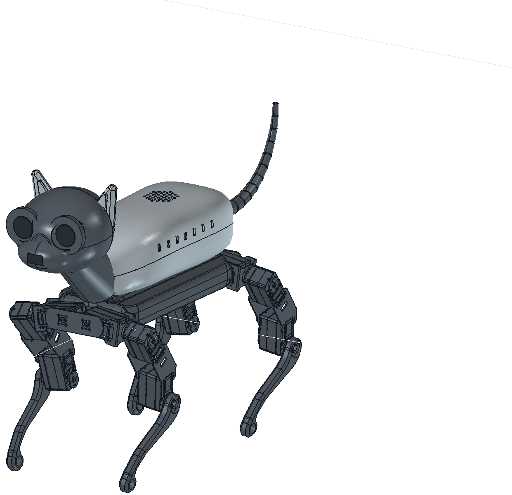

# Skorupa kota - v17

Nadbudowa "kociego" ciała montowana na oryginalnym podwoziu WAVEGO PRO BETA v3.
Podwozie zostaje bez zmian; wszystko powyżej niego jest obrócone o 180 stopni
względem WAVEGO (tam gdzie WAVEGO ma tył, kot ma głowę).

Plik: `Kot_v17_WNETRZE.FCStd` (FreeCAD 1.1). Bazuje na modelu
[aonagorska-art/robot-cat](https://github.com/aonagorska-art/robot-cat)
(`Kot_v6_GRAFIT.FCStd`), przebudowanym pod realne komponenty z `docs/plan-zakupowy.pdf`.

## Układ współrzędnych - uwaga, łatwo się pomylić

Grupa `CatConcept` ma `Placement = Pos(42,0,0) + Yaw 180`. Dla wszystkiego, co w niej
siedzi, przeliczenie lokalne <-> globalne to inwolucja:

    global = (42 - x_lok, -y_lok, z_lok)

W globalnym: **-x to głowa, +x to ogon, +z to góra**. Podwozie WAVEGO ma współrzędne
globalne wprost (bez obrotu).

Dwie pułapki przy edycji `.FCStd` poza FreeCADem:

1. Pliki `*.brp` w archiwum mają **placement już wpieczony w geometrię**, więc
   `global = flip(surowe_brp)`. Jeśli podmieniasz `.brp`, wyzeruj `Placement`
   danego obiektu w `Document.xml`, inaczej przesunięcie policzy się dwa razy.
2. FreeCAD czyta wpisy z archiwum **w kolejności zapisu**, nie po nazwie.
   Przepakowanie `.FCStd` z posortowaną listą plików daje dokument, w którym
   *wszystkie* kształty są puste (`Shape.isNull() == True`). Zachowaj oryginalną
   kolejność wpisów.

## Co siedzi w środku (globalne obwiednie, mm)

| element | x | y | z | źródło wymiaru |
|---|---|---|---|---|
| Akumulator Gens ace 90 x 43 x 19 | -18 .. 72 | -21,5 .. 21,5 | 6,2 .. 25,2 | karta katalogowa |
| Raspberry Pi 4/5 | -19 .. 66 | -28 .. 28 | 45 .. 65 | karta katalogowa |
| Rezerwa Pi 5 / AI HAT+ / chłodzenie | -19 .. 66 | -28 .. 28 | 67 .. 92 | szacunek |
| Głośnik 5 W 100 x 45 x 21 | 6 .. 106 | -22,5 .. 22,5 | 95 .. 116 | plan zakupowy |
| PCA9685 16-ch PWM | 35 .. 95 | -49 .. -34 | 58 .. 98 | karta katalogowa |
| Pololu D24V90F5 | 75,7 .. 116,3 | 10,8 .. 31,2 | 46,2 .. 53,8 | karta katalogowa |
| Przetwornica AUX 5 V (audio) | 73,5 .. 118,5 | -31,5 .. -6,5 | 45,5 .. 60,5 | szacunek |
| Bus Servo Adapter A + USB | -61 .. -19 | 3 .. 30 | 46 .. 64 | szacunek |
| Rezerwa listwy zasilania | 66 .. 118 | -32 .. 32 | 78 .. 92 | szacunek |
| IMU BNO085 | -55,6 .. -30 | -27,8 .. -5 | 45 .. 49,6 | karta katalogowa |
| TTP223 (dotyk) | -54,5 .. -39,5 | -22,5 .. -11,5 | 58 .. 60 | karta katalogowa |
| MAX98357A (wzmacniacz) | -55,2 .. -35,8 | -23,9 .. -6,1 | 72,5 .. 75,5 | karta katalogowa |
| Serwo yaw szyi | -86 .. -62 | -12 .. 12 | 45 .. 74 | szacunek |
| Serwo pochylenia głowy | -133 .. -108 | -15 .. 15 | 92 .. 116 | szacunek |
| Serwo unoszenia ogona | 124 .. 144 | -6 .. 6 | 50 .. 70 | szacunek |
| Serwo yaw ogona | 146 .. 170 | -12 .. 12 | 52 .. 72 | szacunek |
| Kamera Module 3 NoIR Wide | -181,9 .. -169,5 | 16,3 .. 41,3 | 130,8 .. 154,8 | karta katalogowa |
| Oświetlacz IR | -182,7 .. -168,7 | -40,8 .. -16,8 | 130,8 .. 154,8 | szacunek |
| ToF VL53L5CX | -199,5 .. -196,5 | -9 .. 9 | 106,9 .. 119,9 | karta katalogowa |
| ReSpeaker Lite (mikrofony) | -160 .. -125 | -43 .. 43 | 137 .. 149 | do potwierdzenia |

Panel serwisowy na prawej burcie (wszystkie trzy mają wycięte otwory w skorupie):
wyłącznik główny `x 88..108, z 65..78`, gniazdo XT60 `x 58..74, z 61..83`,
port balansera 3S `x 36..50, z 67..77`.

## Co zostało sprawdzone

Miary z dokładnych booleanów FreeCADa (`Shape.common(...).Volume`), nie z obwiedni.

**Przebicia przez grzbiet** (`BackCover`) - zero dla wszystkich obwiedni elektroniki.
Niezerowe zostały tylko celowe:

| element | mm3 | dlaczego celowe |
|---|---|---|
| ComputerDeck | 5380 | półka wtopiona w dolny kołnierz skorupy - to jest mocowanie |
| TailBridge | 845 | belka ogona przechodzi przez tylny wykrój |
| NeckCollar | 372 | szyja przechodzi przez przedni wykrój |
| ChargeSocketXT60 | 418 | kołnierz gniazda na ścianie, wokół wyciętego otworu |
| MainSwitch | 288 | j.w. |
| TailYawServo | 262 | serwo wychodzi przez tylny wykrój do nasady ogona |
| BalancerPort | 198 | j.w. co XT60 |

**Kolizje wewnętrzne** - zostały trzy, wszystkie to połączenia, nie zderzenia:
`TailBase x TailSocket` 1205 mm3 (kołnierz osadzony na nasadzie),
`NeckBridge x NeckColumn` 20 mm3 (spoina), plus złącza w ścianie jak wyżej.

**Głowa** - kamera i oświetlacz IR siedzą w otwartych oczodołach: nie wystają przed
lico (pierścień oka jest 4,6 mm przed obiektywem), ale też nie są niczym zakryte.
ToF jest wtopiony w ściankę pyska i patrzy przez nos.

## Czego jeszcze NIE ma - do zrobienia

1. **Brak jakichkolwiek wsporników.** Poza `ComputerDeck` (półka pod Pi),
   `BatteryTray` (kołyska z wyfrezowanym gniazdem), `NeckBridge`/`TailBridge`
   (belki serw) i kieszeniami serw w `TailBase` - reszta modułów to obwiednie
   zawieszone w powietrzu. Nie ma słupków M2,5, kołnierzy, prowadnic ani otworów
   pod wkręty. PCA9685 w szczególności "wisi" przy lewej burcie.
2. **Skorupa jest jednym kawałkiem.** Do druku i serwisu musi być podzielona na
   segmenty z płaszczyznami podziału, zatrzaskami i kołkami pozycjonującymi.
3. Kształt jest lany/organiczny - docelowo ma być bardziej regularny, żeby dało
   się o coś oprzeć płaskie mocowania.
4. Nie ma prowadzenia kabli ani przepustów.
5. Plan zakupowy mówi o 3 mikroserwach, w modelu są 4 obiekty serw pomocniczych.

## Render

