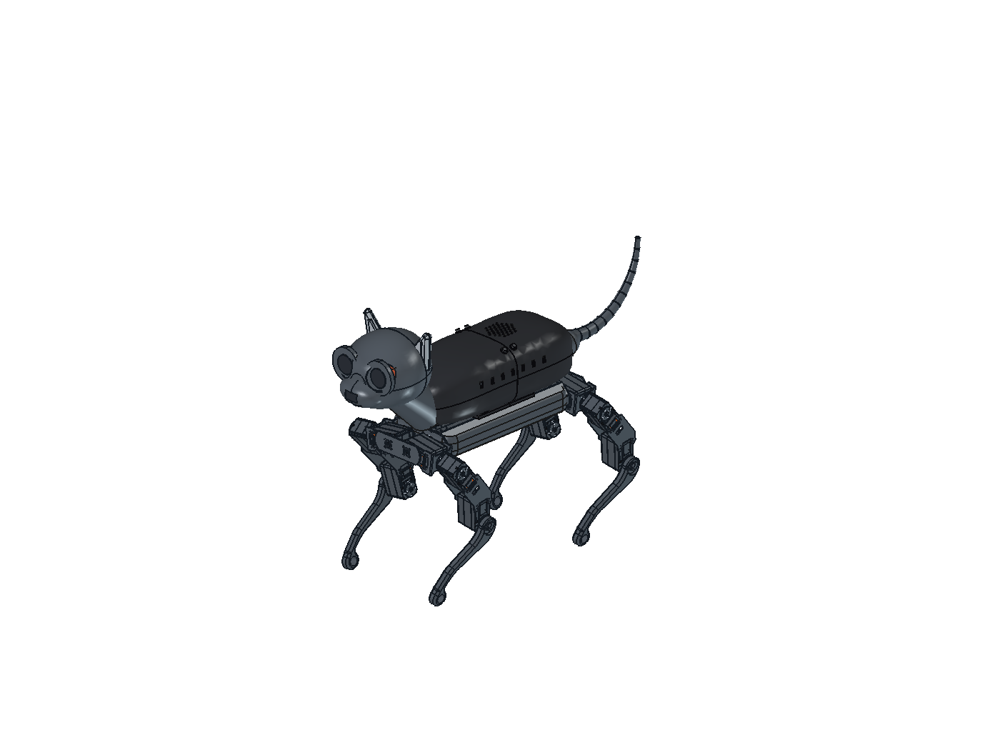
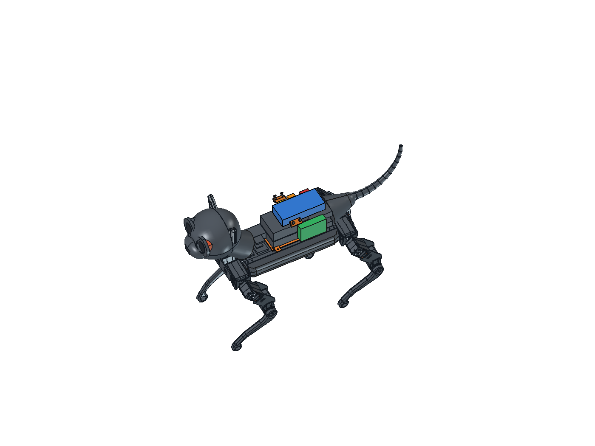

# v18 — dzielony korpus i wymienna tacka, NIE wydanie do druku

Baza: `feat/obudowa-v1`, commit `25f4a32` (v17 Claude'a na skorupie Oli).
Praca na `codex/obudowa-v18-mechanical`, osobny worktree; lokalne modele
w pierwotnym katalogu `robot-cat` pozostają nietknięte.

## Zrobione w tym etapie

- Oryginalna półka `ComputerDeck` była pełną płytką, mimo opisu „otwory
  referencyjne 58 × 49 mm”. Zastępuje ją wymienna tacka `PiTray18`.
- Cztery słupki do wysokości PCB z=45 mm, rozstaw 58 × 49 mm,
  otwory przelotowe Ø2,9 mm, kieszenie nakrętek M2,5 o szerokości 5,3 mm.
- Cztery podniesione kołnierze tacki, otwory Ø3,4 mm, odpowiadające im
  gniazda w skorupie oraz boczne kanały wkładania nakrętek M3.
- Luz obrysu tacki 0,35 mm na stronę (przed drukiem próba pasowania PETG).
- Pi oraz rezerwa HAT/chłodzenia nie zostały przesunięte.
- Otwory wentylacyjne w tacce. Nie są dowodem wystarczającego chłodzenia.
- Korpus podzielony w x=30 mm na przód i tył, ze szczeliną 0,35 mm.
  Dwie wewnętrzne listwy spinają górę; tacka Pi spina dół obu połówek.
- Cztery gniazda śrub dopasowane do zmierzonej normalnej powierzchni
  grzbietu. Łączniki mają kieszenie nakrętek M3; w modelu są uproszczone
  obwiednie czterech śrub M3×12 i czterech nakrętek (bez modelowanego gwintu).
- Pięć nowych części wyeksportowano oddzielnie, z ustawieniem na stole.

Główny plik: **[Kot_v18_SKORUPA_DZIELONA.FCStd](Kot_v18_SKORUPA_DZIELONA.FCStd)**.
`Kot_v18_TRAY_CHECKPOINT.FCStd` zachowuje wcześniejszy etap bez podziału.
Folder `stl-prototype/` zawiera wyłącznie nowe części, **nie komplet kota**.

| część | gabaryty w orientacji STL, mm |
|---|---|
| przód korpusu | 81,3 × 112,9 × 119,9 |
| tył korpusu | 82,3 × 112,9 × 117,9 |
| łącznik lewy/prawy | 24 × 12 × 6 każdy |
| tacka Pi | 91 × 83 × 7 |

Nowe części mieszczą się w 180 × 180 × 180 mm, również z brzegiem 8 mm
wokół podstawy. To sprawdzenie gabarytów, nie zatwierdzony profil slicera.

Rozstaw i odsunięcie otworów Pi wynikają z
[rysunku producenta](https://pip-assets.raspberrypi.com/categories/545-raspberry-pi-4-model-b/documents/RP-008343-DS-1-raspberry-pi-4-mechanical-drawing.pdf),
nie z symetrycznego wycentrowania prostokąta 58 × 49 na całej płytce.

## Kontrola

`tray-validation.json`: poprawność brył, jedna bryła na część, objętość
przenikania tacka/skorupa, tacka/Pi, tacka/rezerwa chłodzenia, drożność
wszystkich trzech grup otworów. Objętości kontrolne muszą być < 0,001 mm³.

`static-clearance.json`: sprawdzenie tacki i dodanego gniazda względem
rzeczywistych umieszczonych części v17. Nie zastępuje testu ruchu nóg,
sprawdzenia przewodów, łbów śrub, wytrzymałości ani próby fizycznego montażu.

`shell-validation.json`: jedna poprawna bryła na każdą połówkę i listwę,
brak przenikania listew z połówkami, brak kolizji nowych listew, gniazd i
obwiedni śrub/nakrętek z umieszczonymi częściami v17. Rozdzielenie połówek
wynika z przecięcia z rozłącznymi półprzestrzeniami; sprawdzono też skrajne
współrzędne powierzchni przy szczelinie. Nie wykonywano kosztownego ponownego
booleana dwóch prawie identycznych powierzchni korpusu.

`print-validation.json`: zero krawędzi nie-manifold (każda krawędź siatki
ma dwa przyległe trójkąty), gabaryty i sumy kontrolne plików STL.

`saved-document-validation.json`: ponowne otwarcie zapisanego FCStd,
pięć poprawnych nowych brył, zgodne objętości, osiem obiektów śrub/nakrętek
oraz zapisany widok całego kota z ukrytymi starszymi wersjami skorupy.

Pierwszy wariant gniazda kolidował z pokrywą i bokami WAVEGO (zmax=38,52).
Poprawiony zaczyna się na z=39 mm; nominalny odstęp wynosi tylko 0,48 mm.
Ten odstęp trzeba zweryfikować na fizycznym podwoziu i wydruku.

## Montaż tacki — projekt wstępny

1. Wsuń cztery nakrętki M3 z wnętrza przez boczne kanały gniazda.
2. Osadź nakrętki M2,5 w tacce od spodu i zamocuj Pi na słupkach.
   Długość śrub zależy od grubości PCB i podkładek; sprawdź, aby końcówki
   nie dosięgały podwozia. Nie dokręcaj śrub na siłę do laminatu.
3. Opuść tackę w gniazdo, następnie przykręć cztery kołnierze śrubami M3×8.
   Typ i wysokość łba wymagają sprawdzenia z docelowymi przewodami Pi.
4. Mocowania mogą być rozebrane bez wyrywania gwintu z PETG.

## Połączenie połówek korpusu

1. Włóż po dwie nakrętki M3 do każdej listwy. Listwy są wymienne lewa/prawa
   w lokalnej orientacji druku; w złożeniu mają osobne położenia.
2. Przyłóż listwy do wewnętrznych gniazd jednej połówki, wkręć luźno po
   jednej śrubie M3×12 od zewnątrz. Nie zaciskaj cienkiej skorupy na siłę.
3. Dosuń drugą połówkę, wkręć pozostałe dwie śruby M3×12, a następnie
   zamocuj tackę Pi czterema M3×8. Wyrównaj krawędzie i dopiero dociągnij.
4. Przy rozbieraniu odkręć tackę i śruby listew. Zabezpiecz elektronikę
   i rozłącz wiązki; obecny model nie ma jeszcze prowadzenia przewodów.

Nowe złącza wymagają łącznie: 4× M3×12 + 4× M3×8 + 8× nakrętka M3,
oraz mocowania M2,5 komputera opisane wyżej. Otwory są luzowe, nie gwintowane
w PETG. Próba pasowania, dostęp narzędzia i montaż fizyczny pozostają wymagane.

Tacka ma podniesione kołnierze: przy druku dnem na stole mogą wymagać
lokalnych podpór. Nie deklarujemy druku bez podpór ani gotowości całej skorupy.
Wymiary geometrii i otworów są w skrypcie budującym; właściwości `Reference`
w FCStd tylko je opisują, nie przeliczają samoczynnie zamrożonych BRepów.

## Blokery i pozostała praca

- **Dokładny model mikroserwa i orczyka**. PDF podaje tylko trzy mikroserwa.
  Bez tego nie można zatwierdzić mechaniki głowy/ogona ani przestrzeni ruchu.
- **Drukarka / pole robocze** przed finalnym podziałem skorupy i połączeniami.
  Obecny podział korpusu mieści się w 180 mm; trzeba potwierdzić profil,
  podpory, adhezję i rzeczywiste luzy dla docelowej drukarki.
- Rozstrzygnięcie: BOM = 2 osie głowy + 1 oś ogona; v17 ma 4 serwa pomocnicze.
  Nie zmieniono tej architektury po cichu i nie dodano zakupu czwartego serwa.
- Potwierdzenie wariantów pozostałych płytek, pakietu, wyłącznika i złączy;
  część obwiedni v17 to nadal szacunki. Nie wiercić według ich rozmiarów.
- Mocowania pozostałej elektroniki, połączenia głowy/szyi/ogona, prowadzenie
  przewodów, pełny dostęp serwisowy, mocowanie nadbudowy do WAVEGO i test ruchu.

## Odtwarzanie

Użyj Pythona dostarczonego z FreeCADem (musi importować `FreeCAD` i `Part`):

```powershell
& '<FreeCAD>/bin/python.exe' tools/freecad/skorupa/build18.py
& '<FreeCAD>/bin/python.exe' tools/freecad/skorupa/check18.py
```

Następnie uruchom `tools/freecad/skorupa/Apply18.FCMacro` w FreeCADzie,
albo przez działający MCP na localhost:3000:

```powershell
./tools/freecad/skorupa/mcp.ps1 -CodeFile tools/freecad/skorupa/Apply18.FCMacro
```

Makro odmawia zastosowania przy niezaliczonych kontrolach. Zapisuje osobny
`Kot_v18_TRAY_CHECKPOINT.FCStd` i zostawia widok całego kota. Nie nadpisuje v17.

Następny etap:

```powershell
& '<FreeCAD>/bin/python.exe' tools/freecad/skorupa/build18_shell.py
& '<FreeCAD>/bin/python.exe' tools/freecad/skorupa/export18.py
./tools/freecad/skorupa/mcp.ps1 -CodeFile tools/freecad/skorupa/Apply18Shell.FCMacro
./tools/freecad/skorupa/mcp.ps1 -CodeFile tools/freecad/skorupa/render18.py
& '<FreeCAD>/bin/python.exe' tools/freecad/skorupa/verify18_saved.py
```

Makra tworzące dokument i eksporter STL odmawiają nadpisania istniejących
wyników. Przy kolejnym wariancie wybierz nowe nazwy, zachowując poprzedni.

## Widok wnętrza

Otwórz główny FCStd i uruchom `tools/freecad/skorupa/V18_Views.FCMacro`.
Pierwsze uruchomienie ukrywa obie połówki korpusu, kolejne je przywraca.
Nie przesuwa części. To widok z ukrytą osłoną, **nie przekrój brył**.
Można też zaznaczyć `ShellFront18` i `ShellRear18` w drzewie i nacisnąć Spację.




