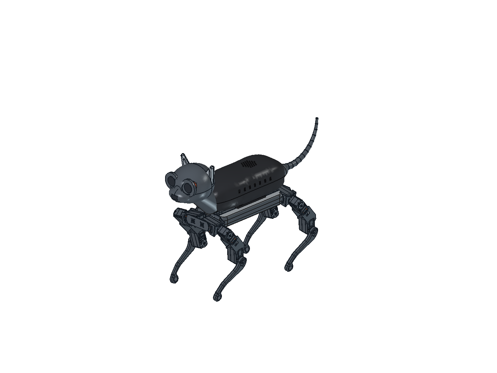

# v19 — ciągła skorupa PETG, drukarka 256³ mm

**Etap prototypowy, nie kompletny zestaw gotowy do wydruku robota.**

Plik złożenia: [Kot_v19_SKORUPA_PETG_256.FCStd](Kot_v19_SKORUPA_PETG_256.FCStd).
Starsze v17 i v18 pozostają bez zmian jako punkty powrotu.
Wszystkie projektowane części drukowane mają być z PETG; elementy handlowe
zachowują swoje materiały. Nie oznacza to zatwierdzenia odziedziczonej ramy
i łap do wykonania z PETG bez dalszej kontroli wytrzymałości.

## Zmiana korpusu

Przywrócono ciągłą skorupę z zapisanego, sprawdzonego etapu tacki v18,
**przed** dodaniem poprzecznego cięcia i jego gniazd. Nie sklejano dwóch
STL-i ani nie wypełniano szczeliny prowizorycznym paskiem.

- Jedna główna skorupa, około **238 × 112,9 × 82,3 mm** w orientacji STL.
- Nie ma poprzecznego szwu, dwóch listew spinających, czterech śrub M3×12
  i czterech nakrętek tego połączenia. W v18 nadal są zachowane.
- Pozostają gniazda i wyjmowana tacka Pi, jej cztery mocowania M3 oraz M2,5
  komputera. Elektroniki, głowy, ogona i nóg nie przesuwano.
- Osobna wcześniejsza osłona brzucha pozostaje. Nie przebudowano jeszcze
  całości na zatwierdzone, rozbieralne połączenie góra/dół/podwozie.
- W drzewie FreeCAD główna skorupa ma nazwę wewnętrzną `BackCover18`,
  ale opis v19. To celowo zachowany obiekt ze sprawdzonego wariantu.

`stl-prototype/` zawiera skorupę, tackę i próbkę. To **nie komplet robota**.
Skorupa z brimem 8 mm na stronę zajmuje 254 mm długości — pozostaje tylko
2 mm łącznie do nominalnej granicy 256 mm. Strefy wyłączone stołu, skirt,
podpory i profil konkretnej drukarki wymagają kontroli w slicerze.
STL stoi dolną płaszczyzną na stole; dach i kołnierze mogą wymagać podpór.
Nie zatwierdzono jeszcze ich usuwania z wnętrza ani jakości powierzchni.

## Próbka pasowań PETG — wydrukuj ją przed dużą skorupą

[PETG_FitGauge19.FCStd](PETG_FitGauge19.FCStd) to osobny, edytowalny model
PartDesign: szkic, Pad, szkic otworów/Pocket oraz szkic kieszeni/Pocket.
STL: [PETG_FitGauge19.stl](stl-prototype/PETG_FitGauge19.stl).
Wymiary 56 × 66 × 6 mm. Płaską podstawą na stół, kieszenie skierowane w górę.

Patrz z góry, **ścięty narożnik na dole po prawej**. Kolumny od lewej
mają x=12, 28, 44 mm; poniżej rzędy od dołu ku górze:

| rząd | lewa | środkowa | prawa |
|---|---:|---:|---:|
| 1, śruba M2,5 — średnica otworu | 2,7 | 2,9 | 3,1 |
| 2, śruba M3 — średnica otworu | 3,2 | 3,4 | 3,6 |
| 3, nakrętka M2,5 — między płaskimi ściankami | 5,1 | 5,3 | 5,5 |
| 4, nakrętka M3 — między płaskimi ściankami | 5,6 | 5,8 | 6,0 |

Wszystkie wartości w mm. Kieszenie mają 2,8 mm głębokości; pod nimi jest
przelot pod śrubę. Wartości środkowe odpowiadają obecnej tacce/gniazdom.
Rząd trzeci bada szerokość kieszeni, nie zatwierdza głębokości wszystkich
docelowych kieszeni M2,5. Próbka nie bada bocznych kanałów wsuwania nakrętek,
poziomych otworów, zatrzasków ani wytrzymałości.

Wydrukuj tym samym PETG i docelowym profilem, po ostygnięciu sprawdź śruby
i rzeczywiste nakrętki. Śruba ma przechodzić bez wkręcania w plastik;
nakrętka wejść bez rozpychania ścian i nie obracać się swobodnie.
Zanotuj najlepszą kolumnę dla każdego rzędu. Nie rozwiercaj próbki przed
pomiarem — wynik służy do korekty CAD lub kompensacji otworów w slicerze.
Nominalne luzy dobrano według lokalnego skilla FreeCAD Fastener Hole Patterns;
nie są uniwersalną gwarancją pasowania dla PETG.

[Widok próbki z góry](petg-probka.png).

## Mocowanie do WAVEGO — wynik pomiaru, jeszcze nie gotowe złącze

`interface-audit.json` zawiera zmierzone powierzchnie cylindryczne i obrysy.
Przykładowe osie po bokach: x=−70/112 mm, y=±31,5 mm.
W zewnętrznych panelach otwory mają Ø2,6 mm, ale w leżącej pod nimi ramie
są współosiowe otwory **Ø2,05 mm**. Sama średnica nie określa rodzaju gwintu
ani tego, czy otwór jest gwintowany w fizycznej części.

`mount-candidate-audit.json` sprawdza cztery hipotetyczne stopy 12×12×4 mm
na wysokości z=38,52 oraz obwiednię trzpienia Ø2,5 mm o długości 14 mm.
Występują przecięcia ze skorupą i z ramą. **To odrzucone obwiednie testowe,
nie zamontowane uchwyty**. Przecięcie trzpienia z otworem Ø2,05 samo w sobie
nie dowodzi błędu istniejącego złącza: może być reprezentacją otworu pod gwint.
Nie rozwiercono ramy i nie dodano fikcyjnych śrub.

[Instrukcja producenta starszego WAVEGO](https://www.waveshare.com/wiki/How_to_Assemble_and_Use)
rozróżnia połączenia M2, M2,5 i M3. Nie przenosimy ich automatycznie na
zaimportowany model WAVEGO Pro ani na drukowaną ramę PETG. Docelowa rama
drukowana wymaga osobnego opracowania gniazd metalowych nakrętek i wzmocnień.

## Weryfikacja i zakres

- Trzy eksportowane części: poprawne pojedyncze bryły, zamknięte siatki,
  po dwa trójkąty na krawędź; mieszczą się w 256³ z brimem 8 mm.
- Brak przenikania skorupy i tacki. Ich geometria pozostaje z v18;
  wcześniejsze kontrole nowego gniazda zachowują swój ograniczony zakres.
- `saved-document-validation.json`: niezależne otwarcie złożenia i próbki,
  kontrola zachowania geometrii/położeń oraz zapisanego widoku.
- Nie wykonano testu fizycznego, obciążeń, chłodzenia, kabli ani pełnego
  przemiatania ruchu. Montaż skorupy do ramy nadal jest do zaprojektowania.

Kolejne zadania: PETG-owa rama i jej połączenie ze skorupą/brzuchem,
mocowania pozostałej elektroniki i wiązek, rzeczywiste interfejsy głowy
i ogona (potrzebny model mikroserwa/orczyka), redukcja czterech pomocniczych
serw v17 do trzech z listy zakupowej oraz kontrola odziedziczonych łap.

## Widok wnętrza i odtwarzanie

Aktywuj złożenie v19 i uruchom `tools/freecad/skorupa/V19_Views.FCMacro`.
Pierwsze uruchomienie ukrywa skorupę, drugie ją przywraca. To odsłonięcie
wnętrza, **nie geometryczny przekrój**. Można też zaznaczyć `BackCover18`
i nacisnąć Spację. Zapisany widok pokazuje całego kota.

Generator: `tools/freecad/skorupa/build19.py`, uruchamiany Pythonem FreeCADa.
Audyt podwozia: `inspect19.py`. Import/zapis przez MCP: `Apply19.FCMacro`.
Kontrola zapisanego wyniku: `verify19.py`. Generatory odmawiają nadpisania
gotowych STL-i i dokumentów: dla kolejnej iteracji wybierz nowy wariant.

