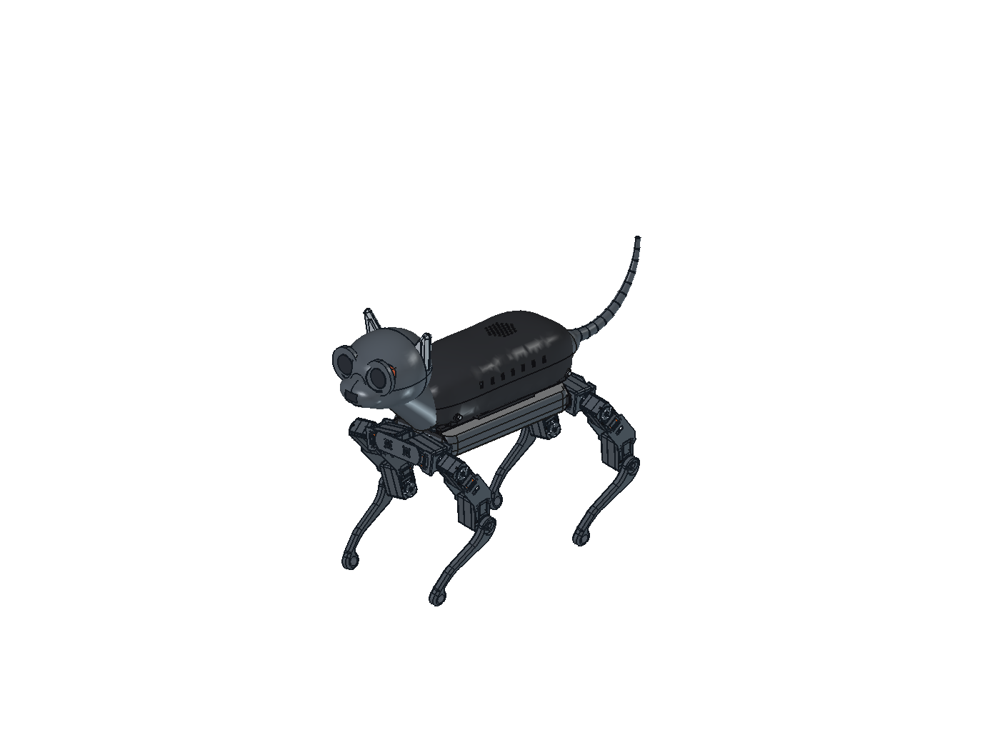

# v20 — cztery połączenia skorupy z podwoziem

**Prototyp PETG, nie wydanie całego robota do druku.**

Złożenie: [Kot_v20_MOCOWANIA_PETG.FCStd](Kot_v20_MOCOWANIA_PETG.FCStd).
Wersje v17–v19 zachowano. Głowa jest nadal po stronie −X, ogon +X.
Nie przesunięto osi serw, łap ani elektroniki.

## Co zostało zaprojektowane

Skorupa ma cztery boczne połączenia śrubowe z osobnymi wspornikami PETG.
Wsporniki zostają na podwoziu po wykręceniu śrub skorupy. Każdy wspornik
jest zamocowany śrubą M2,5 przechodzącą przez górny panel i kołnierz ramy
do **metalowej nakrętki** w dolnej podkładce PETG. Drugi otwór służy do
ustalenia położenia krótkim, drukowanym kołkiem Ø2,4 mm. Kołek jest elementem
ustalającym, nie deklarowanym samodzielnym zabezpieczeniem przenoszącym moment.

| połączenie | przód, global X | tył, global X | global Y |
|---|---:|---:|---:|
| śruba wspornika do ramy | −70 | 112 | ±31,5 |
| kołek ustalający | −80 | 122 | ±31,5 |
| boczna oś śruby skorupy, Z=56 | −63,5 | 124 | kierunek ±Y |

- Otwory przelotowe M2,5: Ø2,9 mm; M3: Ø3,4 mm.
- Wsporniki: szerokość 12 mm, grubość słupka 6 mm z przodu / 7 mm z tyłu,
  zaokrąglenie podstawy R1,2 mm. Pod łbem M2,5 pozostają 3 mm PETG.
- Gniazda łbów M2,5: Ø5,2 mm, zagłębienie 1 mm w stopie. Kanał narzędzia
  przy przednim słupku jest węższy, by nie osłabić kieszeni nakrętki M3.
- Kieszenie sześciokątne: AF5,3 dla M2,5 i AF5,8 dla M3.
- Luz prowadzenia skorupy wokół wsporników: nominalnie 0,35 mm;
  odstęp osiowy wspornik–gniazdo skorupy przed skręceniem: 0,45 mm.
- Skorupa pozostaje jednoczęściowa, bez poprzecznego szwu. Lokalne wybrania
  dolnej krawędzi umożliwiają podnoszenie jej nad wspornikami.
- W modelu są obwiednie wszystkich ośmiu nowych śrub i ośmiu nakrętek.
  Gwint nie jest modelowany; brak również nowych więzów solvera Assembly.

Nominały otworów i schemat szkic/Pocket oparto na lokalnym skillu FreeCAD
**Fastener Hole Patterns**. Próba z rzeczywistym PETG i śrubami nadal wymagana.

## Co zmienia się w istniejącym podwoziu

To wariant **drukowanego** podwozia, nie instrukcja wiercenia części kupnych.
W kopiach dwóch ram i dwóch paneli bocznych powiększono po cztery otwory
górnych kołnierzy do Ø2,9 mm. Osie są oryginalne. Nie zmieniano dolnych
kołnierzy ani interfejsów serw. Stare bryły w złożeniu są ukryte, nie usunięte.

Wersje: `FrameFront20`, `FrameRear20`, `SideLeft20`, `SideRight20`.
Nie mieszaj ich z wcześniejszymi plikami z otworami Ø2,05/2,6 mm.
Sama zmiana otworów **nie zatwierdza** odziedziczonych ścian ramy o grubości
około 1,5 mm do pracy z PETG. Ich wzmocnienie, orientacja warstw i próby
obciążenia pozostają odrębnym zadaniem przed budową działającego robota.

## Łączniki — ten etap

- 4 × śruba M3×16, łeb walcowy Ø6 × 3 mm, oraz 4 × nakrętka M3 AF5,5 × 2,4 mm.
- 4 × śruba M2,5×12, łeb walcowy Ø4,5 × 2,5 mm, oraz 4 × nakrętka M2,5 AF5 × 2 mm.
- 4 wsporniki PETG i 4 dolne podkładki/gniazda nakrętek PETG.

Śruby M3 wystają nominalnie około 1,04–1,53 mm za nakrętkę, M2,5 około 1,58 mm.
To obwiednie CAD, a nie gwarancja wymiarów dowolnego zakupionego łącznika.
Nie stosuj zamiennie nakrętek samohamownych o większej wysokości bez kontroli.
Pozostałe śruby tacki Pi i robota są oddzielnym zestawem.

## Kolejność montażu prototypu

1. Sprawdź pasowania próbą PETG z v19; zweryfikuj też boczny otwór/kieszeń
   w próbnie wydrukowanym wsporniku. Nie wciskaj nakrętek na siłę.
2. Przed zamknięciem podwozia włóż nakrętki M2,5 do dolnych gniazd,
   przyłóż je od spodu górnych kołnierzy ramy. Ten etap wymaga dostępu
   do wnętrza i może wymagać montażu przed osłoną brzucha/elektroniką.
3. Osadź kołki ustalające wsporników i przykręć wsporniki śrubami M2,5×12.
   Włóż boczne nakrętki M3 przed założeniem skorupy.
4. Załóż skorupę na wsporniki; wkręć cztery M3×16 od zewnątrz.
   Dokręcaj równomiernie, bez odkształcania cienkiej skorupy. Nie ustalono
   momentu dokręcania ani trwałości połączeń pod długotrwałym obciążeniem PETG.
5. Przy demontażu usuń cztery boczne M3. Próby CAD potwierdzają odsunięcie
   od tych mocowań, **nie pełną możliwość wyjęcia skorupy z całego robota**:
   połączenia z głową/ogonem i przewody wymagają jeszcze opracowania.
   Tacka Pi nadal należy do skorupy; nie odrywaj podłączonych wiązek.

## Kontrole i ograniczenia

- `validation.json`: 13 poprawnych pojedynczych brył drukowanych oraz
  16 brył łączników; brak wykrytych statycznych kolizji nowych mocowań
  z zachowaną geometrią i między nowymi elementami.
- Brak kolizji cylindrycznej obwiedni narzędzia Ø5 mm, długości 35 mm,
  wychodzącej na zewnątrz od bocznych śrub. To nie kontrola całej rękojeści.
- Próbki unoszenia o 0,5 / 5 / 30 mm: bez przecięcia skorupy ze wspornikami.
  Wybrania wykonano jako skierowane w dół wyciągnięcia obwiedni mocowań.
- `contact-validation.json`: 20 kontroli podparcia pod łbami, nakrętkami
  i dolnymi gniazdami. Co najmniej 99% zadanej powierzchni pierścienia/hex
  ma materiał po stronie podparcia. To kontrola geometryczna, nie analiza naprężeń.
- Sprawdzono także wskazane sąsiednie części i unoszenie nad pozostającymi
  nakrętkami oraz śrubami ramy. Najmniejszy z tych odstępów to około
  **0,66 mm między tylnym wspornikiem a nasadą ogona** — fizyczna próba
  pasowania konieczna; ugięcia i tolerancje mogą ten odstęp zmniejszyć.
- `print-validation.json`: zamknięte siatki i gabaryty; 13 plików mieści się
  w 256³ mm, także z brimem 8 mm. Skorupa nadal zajmuje 238 mm długości.
- `saved-document-validation.json`: ponowne otwarcie, poprawność nowych
  części, zachowane położenia/geometria obiektów źródłowych i sprawdzenie
  objętości usuniętej tylko na otworach czterech zmodyfikowanych kołnierzy.

Nie wykonano próby ruchu nóg, FEA, próby obciążenia, analizy pełzania PETG,
testów cieplnych ani rzeczywistego montażu. Podpory i adhezja wymagają
kontroli w slicerze. Wsporniki w STL leżą na boku (obrót wokół Y o 90°),
dolne gniazda nakrętek mają kieszenie ku górze. Sugerowana orientacja
nie zastępuje sprawdzenia ścieżek druku i wytrzymałości warstw.

## Pliki i podgląd

`stl-prototype/` zawiera **wyłącznie 13 części zmienionych w tym etapie**,
nie cały zestaw robota. Używaj złożenia FCStd jako źródła położeń.
Ukryte starsze części nie są dodatkowymi częściami do wydruku.

`V20_Views.FCMacro` przełącza widoczność `ShellMounted20` (można też
zaznaczyć ją i nacisnąć Spację). Zapisane złożenie pokazuje całego kota.
`mocowanie-v20-przekroj.png` to lokalny wycinek i przekrój gniazda jednego
przedniego mocowania; barwa pomarańczowa wyróżnia nowe części, nie kolor filamentu.

Źródła: `build20.py`, `check20_contacts.py`, `export20.py`, `Apply20.FCMacro`,
`verify20.py`, `Detail20.FCMacro` w `tools/freecad/skorupa/`.
Uruchamianie geometrii Pythonem FreeCADa, makr GUI przez lokalny MCP.
`MountBoreDesign20.FCStd` przechowuje **pomocnicze etapy szkiców i otworów**;
nie jest alternatywnym złożeniem ani kompletnym parametrycznym generatorem.
Końcowe bryły i kieszenie wynikają ze skryptu `build20.py`.

Następne prace: wzmocnienie drukowanej ramy i mocowanie brzucha, uchwyty
pozostałej elektroniki, prowadzenie przewodów, dokładne mikroserwa/orczyki
głowy i ogona (BOM trzy, odziedziczony model cztery), test ruchu i obciążeń.

[Wnętrze](kot-v20-wnetrze.png) · [Detal połączenia](mocowanie-v20-przekroj.png)
