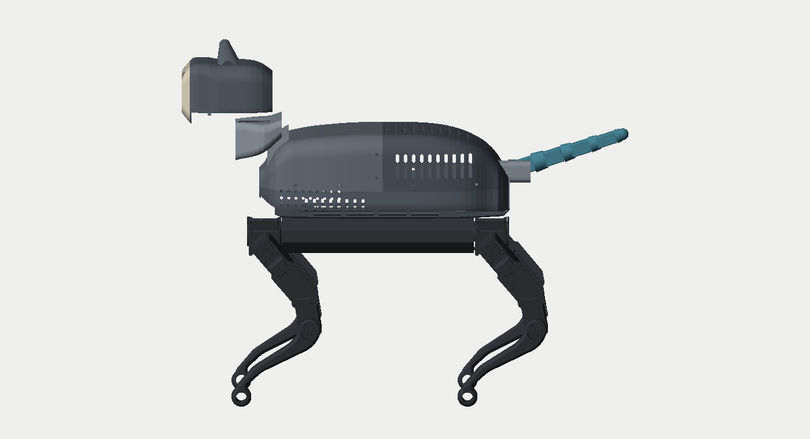
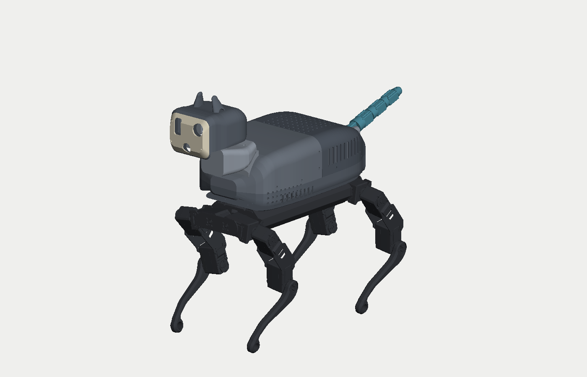
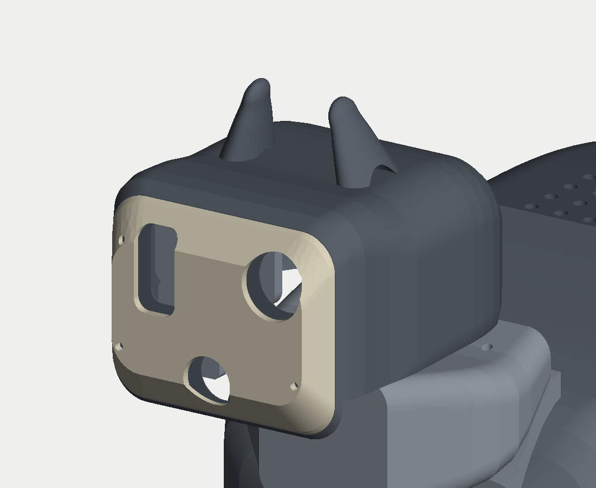
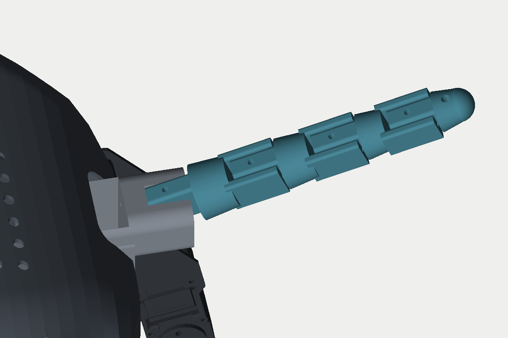

# WAVEGO CAT — mechanika: korpus segmentowy, głowa, napędzany ogon

Branch `claude/robot-design-updates-e03zmx`, oparty na checkpoincie
`codex/wavego-component-layout`. Model:
[WAVEGO_cat_mechanical.FCStd](../WAVEGO_cat_mechanical.FCStd).
**Nadal nie jest gotowy do druku ani montażu.**

## Najpierw: czego brakowało w poprzednim checkpoincie

Plik `.FCStd` z brancha `codex/wavego-component-layout` **nie zawierał żadnej
z opisanych brył**. Grupa `CatMechanicalParts` była pusta, nie było ani jednego
obiektu `PartDesign::Body`, a 26 obwiedni komponentów również nie zostało
zapisanych — mimo że `mechanics/README.md`, `components.json` i `validation.json`
opisywały ich geometrię. To samo dotyczy `WAVEGO_component_layout.FCStd`.
Raporty opisywały więc geometrię, której w repozytorium nie było.

Dlatego cała mechanika CAT jest tu **generowana skryptem**
[wavego_cat_shell.py](../../../tools/freecad/wavego_cat_shell.py), a nie
modelowana ręcznie. Uruchomienie skryptu dwa razy daje ten sam wynik, więc
geometrię można recenzować jako diff parametrów, a nie jako plik binarny —
i nie da się jej już zgubić przy zapisie.

Druga pułapka, na którą trafiliśmy: `layout/components.json` i
`mechanics/components.json` **nie są tym samym plikiem**. Te same identyfikatory
opisują pozycje obrócone o 180° wokół pionu przez X=21. Autorytatywny dla tej
mechaniki jest plik w `mechanics/`; wzięcie tego drugiego wstawia serwo ogona
w klatkę piersiową. Generator odtwarza obwiednie właśnie z `mechanics/`
i usuwa ewentualne duplikaty, więc `manifest_mismatch` jest pusty.

## Co zmieniono w stosunku do checkpointu

Uwagi użytkownika brzmiały: ogon (silniczek, segmentowy), bardziej zaokrąglone
uszy, bardziej zaokrąglony i najlepiej segmentowy korpus, lekka wentylacja.

### Ogon — napędzany, czterosegmentowy

- `CAT_Tail_Mount`: rama w tylnej części kadłuba, przykręcona do dwóch
  istniejących par otworów podwozia (X=112 i 122, Y=±22,5). Kieszeń serwa
  odpowiada rezerwie `TailServo` 36 × 22 × 40 mm, oś wyjściowa pionowa
  w (137; 0; 86). Ramię wychodzi przez otwór w zadzie do czopu w (184; 0; 92).
- `CAT_Tail_Seg_1…4`: łańcuch ogniw pin-do-pinu 34/32/30/28 mm, promienie
  11 → 6,5 mm, każde ogniwo to język na jednym końcu i widelec na drugim,
  czopy Ø2,5 mm. Ostatnie ogniwo kończy się czaszą kulistą — nie ma ostrego
  końca do oszlifowania.
- Napęd: **jedno serwo, dwa cięgna** Ø1,9 mm w kanałach na Y=±5,5 mm,
  zakotwione poprzecznym otworem w ostatnim ogniwie. Cięgna są antagonistyczne,
  więc wychylenie w obie strony jest wymuszone i nie potrzeba sprężyny powrotnej.
  Ogon macha w płaszczyźnie łańcucha (osie czopów są prostopadłe do osi ogona,
  cały łańcuch podniesiony o 18°) — to ten sam ruch, który opisuje
  `robot_cat_teleop/tail.py`.
- Sondy osi potwierdzają drożność wszystkich czopów i obu torów cięgien.
  **Nie potwierdzają** doboru serwa, momentu, tarcia w kanałach, trwałości
  linki ani tego, że cztery przeguby ułożą się w ładny łuk. To pozostaje do
  sprawdzenia na wydruku.

### Głowa — zaokrąglone uszy

Ucho to spłaszczony stożek zakończony **prawdziwą czaszą R6**, złożony
z elipsowych przekrojów (loft), a nie stożek z dołożonym potem zaokrągleniem.
Podstawa R17 jest zatopiona w czaszce, od przodu wycięta jest małżowina.
Czaszka jest węższa niż w checkpoincie (88 zamiast 96 mm) i niższa, więc głowa
przestała być sześcianem. Maska pyska ma otwory kamery, czujnika IR i ToF
oraz styka się z czaszką na styk czołowy w X=−188.

### Korpus — zaokrąglony i trójdzielny

Skorupa to loft zaokrąglonych prostokątów, nie zafazowane pudełko. Dzieli się
na trzy części drukowane osobno:

| Część | Zakres | Po co |
|---|---|---|
| `CAT_Base_Chassis_Tray` | Z 38,52–84 | pas nośny; podłoga z oknami, 8 śrub do podwozia |
| `CAT_Spine_Front` | X < 26, Z > 72 | dostęp do głośnika, PCA9685, bezpieczników, złączy przednich |
| `CAT_Spine_Rear` | X > 26, Z > 72 | dostęp do komputera, ReSpeakera, zasilania, złączy tylnych |

Każdy z górnych segmentów zdejmuje się osobno, po czterech śrubach M3 przez
bok — nie trzeba rozbierać całego zwierzęcia, żeby dostać się do jednego
modułu. Na obu podziałach jest kołnierz i wewnętrzny język z luzem 0,8 mm.

Podłoga pasa jest **pełnej szerokości** (od ściany do ściany) i podniesiona
2 mm nad pokrywę podwozia, bo orczyki nóg sięgają Z=39,52. Płyta krótsza niż
szerokość kadłuba byłaby wyspą — próba dołożenia żeber kończyła się luźnymi
bryłami w OCC. Zamiast tego płyta jest wycięta oknami 30 × 30 mm, które są
jednocześnie odciążeniem i przelotem powietrza z komory dolnej do górnej.

### Wentylacja

Elektronika grzeje się głównie w komputerze (rezerwa `Pi`, X 14–124, Z 49–91),
więc otwory nie są dekoracją:

- **wlot**: szczeliny 3,6 mm na obu bokach pasa, X od −58 do 4, Z 46–64 —
  nisko i z przodu, czyli tam gdzie powietrze jest najzimniejsze;
- **wylot boczny**: szczeliny na obu bokach tylnego segmentu, X 44–122,
  Z 86–114, czyli nad komputerem;
- **wylot grzbietowy**: siatka otworów Ø4,2 mm w rozstawie 10 mm, X 32–118,
  |Y| ≤ 42 — ciepło idzie do góry;
- **otwory akustyczne** Ø3,4 mm po stronie −Y nad głośnikiem;
- otwór na ramię ogona w zadzie działa dodatkowo jako wylot znad przetwornic.

To jest **geometria, nie wynik**. Nie policzono przepływu, nie zmierzono
temperatur, nie sprawdzono, czy konwekcja swobodna wystarczy dla Pi z HAT-em.
Jeżeli nie wystarczy, w tym samym miejscu trzeba będzie osadzić wentylator.

## Kontrola

[validation.json](validation.json) zapisuje kontrolę wykonaną skryptem
[wavego_mechanics_check.py](../../../tools/freecad/wavego_mechanics_check.py),
[generated.json](generated.json) — parametry wejściowe i wynikowe bryły.

Stan na tym branchu:

- 12 części, każda **jedna poprawna bryła**;
- 126 elementów źródłowych WAVEGO bez zmian (obrysy, objętości, liczba brył);
- **żadnej kolizji z podwoziem ani nogami** w pozycji neutralnej;
- kolizje z rezerwami komponentów: 0,17 mm³ (rezerwa IR o czaszkę) — czyli
  praktycznie zero, przy 26 obwiedniach;
- wszystkie sondy otworów i czopów drożne (`blocked_bores` puste);
- **25 faz kłusa bez ani jednej kolizji nóg ze skorupą** (`gait_hits` puste);
- masa PETG wszystkich 12 części: **≈ 497 g** przy gęstości 1,27 g/cm³.

Zostają dwa przecięcia części własnych:
`CAT_Base_Chassis_Tray`/`CAT_Spine_Rear` 144 mm³ oraz
`CAT_Tail_Mount`/`CAT_Tail_Seg_1` 1,2 mm³. Rozłożone na długość styku to
warstwa poniżej 0,1 mm — mieści się w luzie druku, ale **nie jest to zerowy
wynik** i przy przejściu na wersję do druku trzeba to domknąć.

### Czego ta kontrola nie sprawdza

- Wytrzymałości. Najsłabszym ogniwem jest droga obciążenia głowy: siodło →
  przedni segment → pas → cztery przednie śruby podwozia. Wcześniejszy wariant
  z dwiema szynami schodzącymi do podwozia jest **niewykonalny** — rezerwa
  głośnika zajmuje całą klatkę piersiową, a oprawki bezpieczników barki, więc
  szyny musiałyby wyjść poza skorupę. To trzeba policzyć albo przetestować.
- Masy. 497 g samych skorup to dużo dla tego podwozia; to pierwsza rzecz do
  obcięcia, jeśli serwa okażą się za słabe.
- Termiki, przewodów, gwintów, długości śrub, tolerancji druku i doboru
  konkretnych serw głowy i ogona.
- Ruchu ciągłego. `gait_phases: 25` to 25 **dyskretnych** póz dotychczasowego
  podglądu chodu, bez dynamiki, ugięcia nóg pod obciążeniem i bez nowych
  napędów głowy i ogona; pusta lista `gait_hits` nie wyklucza kolizji między
  próbkowanymi fazami ani przy innych parametrach chodu.

## Jak odtworzyć

```bash
freecadcmd tools/freecad/wavego_cat_shell.py     # przebudowa brył i zapis
freecadcmd tools/freecad/wavego_cat_render.py    # podglądy PNG
```

Kontrola (w interpreterze FreeCAD, z otwartą kopią roboczą):

```python
exec(open('tools/freecad/wavego_mechanics_check.py').read())
check(App.getDocument('WAVEGO_cat_mechanical'), gait=False)
```

`check(..., gait=True)` bada 25 dyskretnych faz dotychczasowego chodu nóg —
nie ruch ciągły, nie dynamikę i nie nowe napędy. `presentation(doc)` ustawia
widoczność i kolory i wymaga GUI.

## Podglądy

Renderowane bez GUI (z-bufor na siatkach), więc działają też w CI:

| | |
|---|---|
|  |  |
|  |  |
